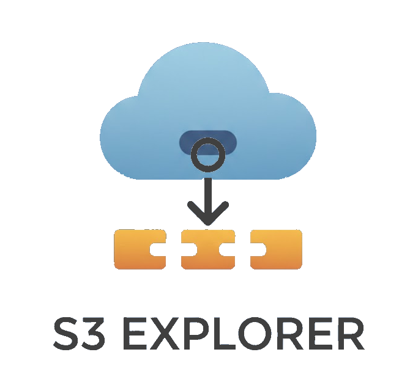

# S3 Explorer

<p align="center">
  
</p>

A cross-platform desktop application for browsing and managing Amazon S3 and S3-compatible object storage. Built with [Avalonia UI](https://avaloniaui.net/) and .NET 8.

## Features

- **Account Management** - Add, edit, and remove S3 accounts; supports AWS S3 and S3-compatible services (MinIO, Wasabi, etc.)
- **Bucket Operations** - Create, delete, and browse buckets
- **Object Management** - Upload files and directories, download objects, create directories, and delete objects
- **Drag and Drop** - Drag files from your file manager into the app to upload, or drag objects out to download
- **Metadata, Tags, and ACLs** - View object metadata, manage tags, and configure access control lists
- **Breadcrumb Navigation** - Navigate nested prefixes with a clickable breadcrumb bar
- **Activity Log** - Real-time logging with upload/download progress tracking
- **Dark/Light Theme** - Toggle between dark and light modes
- **Cross-Platform** - Runs on Windows, macOS, and Linux

## Screenshots

*Coming soon*

## Prerequisites

- [.NET 8.0 SDK](https://dotnet.microsoft.com/download/dotnet/8.0) or later

## Building

```bash
dotnet build
```

## Running

```bash
dotnet run
```

## Publishing

To create a self-contained executable:

```bash
# Windows
dotnet publish -c Release -r win-x64 --self-contained

# macOS
dotnet publish -c Release -r osx-x64 --self-contained

# Linux
dotnet publish -c Release -r linux-x64 --self-contained
```

## Project Structure

```
S3Explorer/
├── assets/              # Logo, icons, and image assets
├── Converters/          # XAML value converters
├── Models/              # Data models (S3Account, S3ObjectItem, etc.)
├── Services/            # S3 service, account storage, dialog service
├── ViewModels/          # MVVM view models
├── Views/               # Avalonia XAML views and code-behind
├── App.axaml            # Application resources and styles
├── App.axaml.cs         # Application startup and initialization
└── Program.cs           # Entry point
```

## Configuration

Account credentials are stored locally at:

| Platform | Path |
|----------|------|
| Windows  | `%APPDATA%\S3Explorer\accounts.json` |
| macOS    | `~/.config/S3Explorer/accounts.json` |
| Linux    | `~/.config/S3Explorer/accounts.json` |

## Dependencies

- [Avalonia UI](https://avaloniaui.net/) 11.3.11 - Cross-platform UI framework
- [CommunityToolkit.Mvvm](https://learn.microsoft.com/en-us/dotnet/communitytoolkit/mvvm/) 8.4.0 - MVVM toolkit
- [AWS SDK for .NET (S3)](https://aws.amazon.com/sdk-for-net/) 4.0.18.2 - Amazon S3 client

## License

This project is licensed under the MIT License. See [LICENSE.md](LICENSE.md) for details.
